# FLspam: Federated Learning for SMS Spam Detection

A research project exploring **adversarial robustness in federated learning** for SMS spam detection. This application combines federated learning (Flower), parameter-efficient fine-tuning (LoRA), and reinforcement learning (GRPO) to create a spam detector that can defend against adaptive attackers.

**Key Research Question**: Can we train a spam detector that remains robust when an adversary actively generates evasive spam using RL?

[](https://colab.research.google.com/drive/1QunSUXh-8hEQ-QBLdTWaTPZfNSh-B6di?usp=sharing)

## Highlights

- 🌐 **Federated Learning**: Privacy-preserving training with Flower across 20 simulated clients
- 🔧 **Parameter-Efficient**: ModernBERT + LoRA (~300K trainable params, 0.2% of model)
- 🎯 **Adversarial Training**: GRPO-trained Qwen3-1.7B generates evasive spam to harden the detector
- 📊 **Synthetic Data**: LLM-generated persona-based SMS conversations for realistic training
- 🔄 **Automated Pipeline**: Adversarial rounds run automatically during FL training

## Architecture


## Quick Start (Colab)

The easiest way to try FLspam is via the Colab notebook:

```bash
# Example FL training with adversarial rounds
!uv run flwr run . --run-config "num-server-rounds=10 spam-strategy='dirichlet' spam-alpha=0.3 adversarial-rounds='2,4,6' sft-epochs=1 local-epochs=1"
```

This runs 10 FL rounds with non-IID data distribution (Dirichlet α=0.3) and adversarial training at rounds 2, 4, and 6.

## Features

- **Federated Learning**: Privacy-preserving training across distributed clients
- **Parameter-Efficient**: Only LoRA adapters (~300K params) exchanged, not full model
- **Synthetic Data**: Realistic SMS conversations from persona networks
- **Adversarial Robustness**: GRPO-trained attacker generates evasive spam to harden the detector
- **Automated Pipeline**: Adversarial training can run automatically at specified FL rounds

## Project Structure

```
FLspam/
├── src/
│   ├── client_app.py          # Flower client for federated training
│   ├── server_app.py          # Flower server with W&B logging & adversarial hooks
│   ├── task.py                # Data loading & training logic
│   ├── prepare_dataset.py     # Generate ham/spam JSON files
│   ├── model/
│   │   └── modernbert.py      # ModernBERT + LoRA classifier
│   ├── synthetic_data/
│   │   ├── config.py          # Configuration constants
│   │   ├── text_utils.py      # SMS text cleaning & validation
│   │   ├── generator.py       # Core SMS generation logic
│   │   ├── personas.py        # Persona network generator
│   │   ├── sms_generation.py  # Backward-compatible entry point
│   │   └── sms_colab_generation.ipynb  # Colab notebook
│   └── adversarial/
│       ├── config.py          # GRPO training configuration
│       ├── prompts.py         # Spam task templates & contexts
│       ├── rewards.py         # Reward functions (detector bypass + quality)
│       ├── trainer.py         # GRPO training loop
│       ├── fl_integration.py  # FL pipeline integration
│       └── train.py           # Standalone CLI entry point
├── tests/
│   ├── test_dataset.py        # Dataset processing tests
│   └── test_flower_config.py  # Flower configuration & import tests
├── data/
│   ├── personas.json          # Generated personas (by UUID)
│   ├── relationships.json     # Relationship graph between personas
│   ├── conversations.json     # Generated SMS conversations
│   └── super_sms_dataset.csv  # External spam dataset (Super SMS)
└── pyproject.toml
```

## Installation

```bash
# Using uv (recommended)
uv sync

# With adversarial training dependencies (requires GPU)
uv sync --extra adversarial

# Login to W&B for experiment tracking
wandb login
```

<details>
<summary>Using pip instead</summary>

```bash
pip install -e .

# With adversarial training
pip install -e ".[adversarial]"
```

</details>

## Quick Start

### 1. Generate Synthetic Data (or use existing)

```bash
# Generate persona network
uv run python -m src.synthetic_data.personas

# Generate SMS conversations (requires GPU)
python -m src.synthetic_data.sms_generation
```

### 2. Prepare Dataset

Process raw data into ham/spam message files:

```bash
uv run python -m src.prepare_dataset
```

This creates:
- `data/ham_messages.json` - Messages received by personas (label=0)
- `data/spam_messages.json` - Spam messages for distribution (label=1)

### 3. Run Federated Learning

```bash
# Run federated training
uv run flwr run .
```

## Model Architecture

**ModernBERT-base + LoRA** for efficient federated fine-tuning:

- Base: [answerdotai/ModernBERT-base](https://huggingface.co/answerdotai/ModernBERT-base) (~150M params)
- LoRA: rank=8, alpha=16, targeting attention layers (`Wqkv`, `Wo`)
- Output: Single logit with sigmoid (binary classification)
- **Trainable params**: ~300K (0.2% of total)

Only LoRA adapters + classifier head are exchanged during FL, reducing communication cost.

## Spam Distribution Strategies

Configure in `pyproject.toml`:

```toml
[tool.flwr.app.config]
spam-strategy = "iid"      # or "dirichlet"
spam-alpha = 0.5           # Dirichlet concentration (lower = more non-IID)
```

| Strategy | Description |
|----------|-------------|
| `iid` | Equal spam distribution across all clients |
| `dirichlet` | Non-IID: some clients get more spam (α controls skewness) |

## Synthetic Data Generation

### Generate Persona Network

Creates main personas with ~100+ contacts each using [nvidia/Nemotron-Personas-USA](https://huggingface.co/datasets/nvidia/Nemotron-Personas-USA).

```bash
uv run python -m src.synthetic_data.personas
```

**Features:**
- Smart matching: partners by marital status, colleagues by occupation, friends by shared hobbies
- Configurable contact distribution (family, friends, colleagues, professionals, etc.)
- Multiple conversations per relationship
- Outputs: `data/personas.json`, `data/relationships.json`

### Generate SMS Conversations

Generates realistic SMS conversations using **distilabel + vLLM with Qwen3**.

```bash
# On Linux with NVIDIA GPU (T4, A10, etc.)
python -m src.synthetic_data.generator

# Or use the Colab notebook: src/synthetic_data/sms_colab_generation.ipynb
```

**Features:**
- Batched generation with vLLM + prefix caching for efficiency
- SMS style adapted to persona age/education
- Scenario-based conversations
- Quality controls (length, repetition, cleanup)

**Module Structure:**
- `config.py` - All configuration (paths, model, vLLM settings, scenarios)
- `text_utils.py` - Message cleaning, quality checks, conversation end detection
- `generator.py` - Core generation with `generate_conversations()`, `build_prompt()`
- `sms_generation.py` - Re-exports everything for backward compatibility

## Adversarial Training (Two-Phase: SFT → RL)
 
 Train an attacker model to generate spam that bypasses the federated detector. Uses a two-phase approach:
 
 1. **SFT Phase**: Fine-tune on real spam data to learn spam patterns (runs once if adapter missing)
 2. **RL Phase**: GRPO training to bypass detector while maintaining spam quality (runs every adversarial round)
 
 **Why SFT is required:**
 Without SFT pre-training, the model will **gamify the reward** by generating innocuous ham messages that trivially bypass the detector (e.g., "Hey, how are you?"). The detector correctly classifies these as ham, giving high reward, but the model never learns to generate *actual spam*. SFT on real spam data teaches the model what spam looks like, then RL optimizes for bypass while the LLM judge ensures spam quality is maintained.

### Architecture

```mermaid
flowchart TB
    subgraph FL["Federated Learning Loop"]
        direction TB
        FLServer["FL Server<br/>(Flower)"]
        FLClients["FL Clients<br/>(ModernBERT + LoRA)"]
        Aggregation["FedAvg<br/>Aggregation"]
        
        FLServer --> FLClients
        FLClients --> Aggregation
        Aggregation --> FLServer
    end

    subgraph ADV["Adversarial Training (Rounds 5, 10, ...)"]
        direction TB
        
        subgraph PHASE1["Phase 1: SFT (runs once)"]
            SpamData[("Real Spam Data<br/>spam_messages.json")]
            SFTModel["Qwen3-1.7B<br/>+ LoRA"]
            SpamData --> SFTModel
        end
        
        subgraph PHASE2["Phase 2: RL (GRPO)"]
            direction TB
            Generator["Generator<br/>Qwen3-1.7B + LoRA<br/>(SFT-initialized)"]
            SMS["Generated SMS"]
            
            subgraph REWARD["Combined Reward Function"]
                direction LR
                Detector["Detector<br/>ModernBERT + LoRA<br/>(from FL)"]
                Judge["LLM Judge<br/>Qwen3-4B-Instruct"]
                Diversity["Diversity<br/>Penalty<br/>(Jaccard)"]
            end
            
            Generator --> SMS
            SMS --> Detector
            SMS --> Judge
            SMS --> Diversity
            
            Detector -->|"bypass×boost<br/>gaming: -10"| RewardSum
            Judge -->|"ham×judge×scale"| RewardSum
            Diversity -->|"penalty: -1 max"| RewardSum
            RewardSum["Total Reward"] -->|"GRPO Update"| Generator
            
            Scheduler["Progress Scheduler<br/>(rolling bypass rate)"]
            Scheduler -->|"boost/scale"| RewardSum
        end
        
        subgraph CALLBACKS["Training Callbacks"]
            Profiler["Profiler<br/>(timing)"]
            BypassTracker["Bypass Tracker<br/>(top-k models)"]
            EarlyStop["Early Stopping<br/>(mode collapse)"]
        end
        
        SFTModel -->|"merge + fresh LoRA"| Generator
        PHASE2 --> CALLBACKS
    end

    subgraph OUTPUT["Outputs"]
        BypassLog[("bypass_samples.json<br/>(HAM prob ≥ 0.5)")]
        SelectedBypasses["select_best_bypasses()<br/>(judge ≥ 0.4, dedupe)"]
        SpamDataset[("spam_messages.json<br/>+ adversarial samples")]
    end

    FL -->|"Save detector<br/>checkpoint"| ADV
    ADV -->|"Log bypasses"| BypassLog
    BypassLog --> SelectedBypasses
    SelectedBypasses -->|"80/20 train/val"| SpamDataset
    SpamDataset -->|"Adversarial samples<br/>to ALL clients"| FL

    style FL fill:#e1f5fe
    style ADV fill:#fff3e0
    style OUTPUT fill:#e8f5e9
    style PHASE1 fill:#fce4ec
    style PHASE2 fill:#fff8e1
    style REWARD fill:#f3e5f5
    style CALLBACKS fill:#e0f2f1
```



**Detailed Flow:**

```
┌─────────────────────────────────────────────────────────────────┐
│                         PHASE 1: SFT                            │
│  Real Spam Data ──► Qwen3-1.7B + LoRA                           │
│                     (learns spam patterns)                      │
└─────────────────────────────────────────────────────────────────┘
                              │
                              ▼
┌─────────────────────────────────────────────────────────────────┐
│                         PHASE 2: RL (GRPO)                      │
│                                                                 │
│  ┌──────────────────┐         ┌─────────────────────┐          │
│  │ SFT-trained Gen  │ ──────► │  Generated SMS      │          │
│  │ Qwen3-1.7B+LoRA  │         └──────────┬──────────┘          │
│  └────────▲─────────┘                    │                      │
│           │                              ▼                      │
│           │              ┌───────────────────────────────┐      │
│           │              │        REWARD SIGNALS         │      │
│           │              │  ┌─────────────────────────┐  │      │
│           │              │  │ ModernBERT Detector     │  │      │
│           │◄─────────────│  │ bypass=+2, gaming=-10   │  │      │
│           │              │  └─────────────────────────┘  │      │
│           │              │  ┌─────────────────────────┐  │      │
│           │              │  │ LLM Judge (quality)     │  │      │
│           │◄─────────────│  │ Qwen3-4B-Instruct-2507  │  │      │
│           │              │  │ bonus: +3 max           │  │      │
│           │              │  └─────────────────────────┘  │      │
│           │              │  ┌─────────────────────────┐  │      │
│           │              │  │ Diversity Penalty       │  │      │
│           │◄─────────────│  │ Jaccard similarity      │  │      │
│           │              │  │ penalty: -1 max         │  │      │
│           │              │  └─────────────────────────┘  │      │
│           │              └───────────────────────────────┘      │
│           │                                                     │
│  ┌────────┴────────────────────────────────────────────────┐   │
│  │                    CALLBACKS                             │   │
│  │  • Profiler (timing per component)                       │   │
│  │  • BypassTracker (saves top-2 models by bypass score)    │   │
│  │  • EarlyStop (similarity≥0.7 for 10 steps = stop)        │   │
│  └──────────────────────────────────────────────────────────┘   │
└─────────────────────────────────────────────────────────────────┘
                              │
                              ▼
┌─────────────────────────────────────────────────────────────────┐
│                    FL INTEGRATION                               │
│                                                                 │
│  bypass_samples.json ──► select_best_bypasses() ──► spam_msgs  │
│  (HAM prob ≥ 0.5)        (judge ≥ 0.4, dedupe)      + adversarial│
│                                                                 │
│  Adversarial samples distributed to ALL FL clients (uniform)   │
│  with consistent train/val split across clients                │
└─────────────────────────────────────────────────────────────────┘
```

### Default Configuration

All models are loaded once and kept in GPU memory:

| Component | Model | Size | Purpose |
|-----------|-------|------|---------|
| **Generator** | `unsloth/Qwen3-1.7B` | 1.7B | Spam generation (SFT + RL LoRA) |
| **Judge** | `unsloth/Qwen3-4B-Instruct-2507` | 4B (bf16) | Quality scoring (unfinetuned, smarter) |
| **Detector** | `ModernBERT-base` + LoRA | 150M | Spam classification |

**Training defaults** (A100-80GB):
- `batch_size`: 64 prompts per step
- `total_episodes`: 15,360 (~240 steps)
- `learning_rate`: 5e-5
- `warmup_ratio`: 0.03
- `temperature`: 1.0 (higher for diversity)
- `repetition_penalty`: 1.15 (anti-mode-collapse)
- `diversity_weight`: 1.0 (batch similarity penalty)
- Saves top-2 models based on bypass score
- ~12s/step, ~48 min total training time

### Two-Phase Training (Recommended)

```bash
# Full pipeline: SFT then RL (~240 steps, ~48 min on A100-80GB)
uv run -m src.adversarial.train_twophase \
    --detector-path final_model \
    --spam-path data/spam_messages.json \
    --use-judge

# Skip SFT (use existing adapter)
uv run -m src.adversarial.train_twophase \
    --detector-path final_model \
    --rl-only \
    --sft-adapter sft_spam_lora \
    --use-judge

# See all options
uv run -m src.adversarial.train_twophase --help
```

### Reward Structure

The reward function combines detector bypass with quality scoring, using a **progress-based scheduler** that dynamically adjusts weights based on training progress.

**Core Insight**: We want the model to learn BOTH bypass AND quality simultaneously:
- If quality bonus only on bypass: model has no quality gradient when detected
- If quality bonus always full: model maximizes judge, ignores detector
- Solution: Scale quality by `ham_prob` AND dynamically boost detector signal when bypass rate is low

#### Progress-Based Scheduler

The scheduler tracks rolling bypass rate over the last 10 steps and adjusts reward weights:

| Rolling Bypass Rate | Bypass Boost | Judge Scale | Strategy |
|--------------------|--------------|-------------|----------|
| < 10% | 2.0× | 0.5× | **Focus on bypass** - model needs to learn evasion first |
| 10-30% | Linear | Linear | **Transition** - gradually shift focus |
| > 30% | 1.0× | 1.0× | **Balanced** - model can bypass, optimize quality |

This prevents the model from getting stuck: if bypass rate drops, the scheduler automatically boosts detector signal.

#### Judge Scoring (0-5 Scale)

The LLM judge uses a simplified 0-5 scale with clear categories:

| Score | Category | Description |
|-------|----------|-------------|
| 0 | Not spam | Normal conversation (HAM penalty: -3.0) |
| 1 | Weak | Spam-like but obvious/easily filtered |
| 2 | Basic | Simple promotional spam |
| 3 | Good | Convincing urgency tactics |
| 4 | Convincing | Sophisticated social engineering |
| 5 | Highly deceptive | Extremely persuasive |

**Success threshold**: Score ≥ 2 (normalized 0.4) is considered successful spam.

#### Reward Components

| Component | Formula | Description |
|-----------|---------|-------------|
| **Base reward** | `(ham_prob - 1.0) × bypass_boost` | How close to bypass, boosted when struggling |
| **Quality bonus** | `ham_prob × judge × weight × judge_scale` | Scaled by bypass proximity AND scheduler |
| **Bypass bonus** | `+2.0 × bypass_boost` | Only if `ham_prob > 0.5` AND `judge ≥ 0.4` |
| **Gaming penalty** | `-10.0` | If bypass but `judge < 0.4` |
| **HAM penalty** | `-3.0` | If judge gives 0 (not spam at all) |

**Example rewards** (judge_weight=3.0, judge_score=0.8, bypass_boost=1.0, judge_scale=1.0):

| ham_prob | Status | Base | Quality Bonus | Bypass | Total |
|----------|--------|------|---------------|--------|-------|
| 0.1 | Detected | -0.9 | 0.1×0.8×3=0.24 | — | **-0.66** |
| 0.3 | Detected | -0.7 | 0.3×0.8×3=0.72 | — | **+0.02** |
| 0.6 | Bypass | — | 0.6×0.8×3=1.44 | +2.0 | **+3.44** |

**With low bypass rate** (bypass_boost=2.0, judge_scale=0.5):

| ham_prob | Status | Base | Quality Bonus | Bypass | Total |
|----------|--------|------|---------------|--------|-------|
| 0.1 | Detected | -1.8 | 0.1×0.8×3×0.5=0.12 | — | **-1.68** |
| 0.3 | Detected | -1.4 | 0.3×0.8×3×0.5=0.36 | — | **-1.04** |
| 0.6 | Bypass | — | 0.6×0.8×3×0.5=0.72 | +4.0 | **+4.72** |

**Tracked in W&B**: `scheduler/rolling_bypass_rate`, `scheduler/bypass_boost`, `scheduler/judge_scale`

**Anti-Mode-Collapse Measures:**
| Measure | Default | Description |
|---------|---------|-------------|
| `temperature` | 1.0 | Higher temperature for more diverse sampling |
| `repetition_penalty` | 1.15 | Discourages repeating tokens/phrases |
| `diversity_weight` | 1.0 | Penalizes similar outputs within batch (Jaccard similarity) |

**Diversity Tracking:**
- Computes pairwise **Jaccard similarity** on token sets within each batch
- Logs `diversity/avg_similarity` (0=diverse, 1=identical) and `diversity/avg_penalty` to W&B
- Penalty applied when similarity > 0.1, scaled up to `diversity_weight` at similarity 0.5+

**Early Stopping (Mode Collapse Detection):**

Training stops automatically when the model gets stuck:

| Condition | Threshold | Description |
|-----------|-----------|-------------|
| Mode collapse | `similarity ≥ 0.7` for 10 steps | Model generating identical outputs |
| Zero bypasses | 0 bypasses for 20 steps | Model gave up / producing only detectable spam |

Tracked in W&B: `early_stop/high_similarity_streak`, `early_stop/zero_bypass_streak`

**LLM Judge** (Qwen3-4B-Instruct-2507):
- Uses JSON format with examples for consistent scoring
- Evaluates: scam intent, call-to-action, urgency, professionalism
- Score 0-5 normalized to 0-1, then multiplied by judge_weight

| Message Type | Judge Score | Quality Bonus |
|--------------|-------------|---------------|
| Normal friendly message | 0/5 | +0.0 (+ HAM penalty) |
| Weak spam, no CTA | 1/5 | +0.6 |
| Basic spam with link | 2/5 | +1.2 |
| Good scam + urgency | 3/5 | +1.8 |
| Convincing social engineering | 4/5 | +2.4 |
| Highly deceptive | 5/5 | +3.0 |

### Integrated FL Pipeline

Adversarial training runs automatically at specified FL rounds:

```toml
# pyproject.toml
[tool.flwr.app.config]
adversarial-rounds = [5, 10]    # Run adversarial at these rounds
adversarial-episodes = 4000     # Training episodes per round
adversarial-samples = 200       # Samples to add to dataset
```

**What happens at adversarial rounds:**
1. Save current aggregated detector checkpoint
2. Clear FL model from GPU (memory optimization)
3. Train Qwen3 generator against detector (GRPO)
4. Select best bypass samples (≥50% HAM probability AND judge ≥ 0.4)
5. Add adversarial samples to training data (80/20 train/val split)
6. Reload FL model and continue training

This creates a feedback loop: detector improves → attacker adapts → detector learns from attacks.

### Standalone Training (Legacy)

For single-phase RL training without SFT:

```bash
# Install adversarial dependencies
pip install -e ".[adversarial]"

# Train adversarial generator against a saved detector
uv run -m src.adversarial.train --detector-path checkpoints/latest

# With custom settings
uv run -m src.adversarial.train \
    --detector-path checkpoints/round_5 \
    --total-episodes 8000 \
    --batch-size 128 \
    --num-generations 8

# See all options
uv run -m src.adversarial.train --help
```

### Outputs

- **SFT adapter**: `sft_spam_lora/` - SFT-trained generator weights
- **RL adapter**: `rl_spam_lora/` - RL-trained generator weights  
- **Top-2 checkpoints**: `rl_spam_lora/checkpoints/` - Best models by bypass score
- **Bypass samples**: `bypass_samples.json` - High-confidence bypasses with scores

**Bypass score** = quality_bypass_rate × avg_judge_score
- `quality_bypass_rate`: % of samples that bypass detector AND have judge score ≥ 0.4 (2/5)
- `avg_judge_score`: Average judge score for quality bypasses

Example bypass log entry:
```json
{
  "step": 50,
  "sms": "Congratulations! You've won...",
  "ham_prob": 0.92,
  "spam_prob": 0.08,
  "reward": 0.75,
  "judge_score": 0.8,
  "length": 145
}
```

- **W&B logs**: Training curves, bypass metrics, diversity tracking, early stopping streaks
  - `bypass/rate`, `bypass/quality_rate`, `bypass/score`
  - `diversity/avg_similarity`, `diversity/avg_penalty`
  - `early_stop/high_similarity_streak`, `early_stop/zero_bypass_streak`

### Memory Management

The adversarial module carefully manages GPU memory:
- Clears FL model before loading generator + detector
- Uses `gc.collect()` + `torch.cuda.empty_cache()` between phases
- Reloads FL model after adversarial training completes

## Experiment Tracking

W&B integration logs:
- Per-round metrics (train_loss, eval_loss, eval_acc)
- Final model as artifact
- Run configuration

View experiments at: https://wandb.ai/your-username/flspam

## Testing

```bash
# Run all tests
uv run pytest tests/ -v

# Run with coverage
uv run pytest tests/ --cov=src
```

## Configuration

Edit `pyproject.toml`:

```toml
[tool.flwr.app.config]
# Federated Learning
num-server-rounds = 10
fraction-train = 0.8
local-epochs = 2
lr = 1e-4
save-every = 1                   # Checkpoint frequency

# Data Distribution
spam-strategy = "iid"            # or "dirichlet"
spam-alpha = 0.5                 # Dirichlet concentration

# Adversarial Training (optional)
adversarial-rounds = [5]         # FL rounds to run adversarial training
adversarial-episodes = 4000      # GRPO training episodes
adversarial-samples = 200        # Samples to add to dataset

[tool.flwr.federations.local-simulation]
options.num-supernodes = 20      # Must match persona count
```

## Optimization History

This section documents the iterative improvements made to the adversarial training pipeline, from initial implementation to the current optimized version.

### Model Selection

| Change | Before | After | Impact |
|--------|--------|-------|--------|
| Base model | Qwen3-0.6B | **Qwen3-4B-Instruct-2507** | Better spam quality, stronger adversary |
| Thinking mode | `<think>` tags generated | Non-thinking variant | Cleaner outputs, no wasted tokens |
| Judge model | Separate 0.6B model | Same 4B model (unfinetuned) | Unified pipeline, better quality assessment |

**Key insight**: Qwen3-4B-Instruct-2507 (suffix `-2507`) is the non-thinking variant. The standard Qwen3 models generate `<think>...</think>` reasoning blocks by default, which wastes tokens and clutters output.

### Performance Optimizations

| Issue | Solution | Improvement |
|-------|----------|-------------|
| 262s/step | Batch LLM judge (32 at a time instead of 1) | **5x faster → 54s/step** |
| Judge bottleneck | Use Unsloth for judge inference | Faster tokenization + generation |
| Low GPU utilization | ULTRA batch sizes (256 for A100-80GB) | Better throughput |
| Wasted warmup | Reduce warmup_ratio 0.1 → 0.03 | More effective training steps |

### Training Hyperparameters

| Parameter | Initial | Final | Reason |
|-----------|---------|-------|--------|
| `learning_rate` | 5e-6 | **5e-5** | Faster convergence (plateau at step 15-20) |
| `warmup_ratio` | 0.1 | **0.03** | Minimal warmup (~2 steps for 60 total) |
| `total_episodes` | 8000 | **15360** | 60 steps for meaningful learning |
| `batch_size` (A100-80GB) | 64 | **256** | Maximize GPU utilization |

### Reward Function Evolution

The reward function went through several major iterations:

#### Version 0: Hand-Crafted Rules (Abandoned)

The original approach used extensive regex-based rules to validate spam quality:

```python
# Old approach: ~15 regex patterns + heuristics
URL_PATTERN = re.compile(r"https?://\S+|www\.\S+|\S+\.(com|net|org)...")
PHONE_PATTERN = re.compile(r"\b\d{3}[-.\s]?\d{3}[-.\s]?\d{4}\b|...")
SHORT_CODE_PATTERN = re.compile(r"\b(text|reply|send)\s+\w+\s+(to\s+)?\d{4,6}\b")
REPLY_KEYWORD_PATTERN = re.compile(r"\b(reply|text|send)\s+(stop|yes|no)...")
EMAIL_PATTERN = re.compile(r"\b[\w.-]+@[\w.-]+\.\w+\b")
CALL_ACTION_PATTERN = re.compile(r"\b(call|dial|ring|contact)\s*(us|me|now)...")
# ... plus fake phone detection, garbage detection, prompt leakage detection
```

**Problems**:
- 🎮 **Gamification**: Model learned to game specific patterns (add URL → get reward)
- 🔧 **Fragile rules**: `_is_fake_phone()` detected 555-xxx-xxxx but model found 556-xxx-xxxx
- 🎯 **Cat-and-mouse**: Every new rule led to new gaming strategies
- 📏 **Arbitrary thresholds**: "min 20 chars", "max 50% same character" - why those numbers?
- 🧩 **Incomplete coverage**: Can't enumerate all spam characteristics with regex

**Reward structure (v0)**:
```python
if ham_prob > 0.5:  # Bypassed detector
    if has_url or has_phone or has_cta:  # Has "payload"
        score = 4.0 * ham_prob  # Big reward
    else:
        score = -0.5  # Penalty for "gaming"
else:
    score = -1.0 * spam_prob  # Detected = bad
```

#### Version 1: Detector-Only (Simplified)

Removed all hand-crafted rules, just used detector signal:

```python
# Simple: HAM probability - SPAM probability
reward = ham_prob - spam_prob  # Range: [-1, +1]
```

**Problem**: Model generated innocuous messages like "Hey, want to grab lunch?" that fooled the detector but weren't spam at all.

#### Version 2: Added LLM Judge (Current)

Let an LLM evaluate spam quality instead of regex rules:

```python
# Combined reward: 70% detector + 30% judge
detector_reward = ham_prob - spam_prob  # [-1, +1]
judge_reward = (judge_score - 0.5) * 2 * 0.3  # [-0.3, +0.3]
total_reward = detector_reward + judge_reward
```

**Why LLM judge works better**:
- ✅ Understands context, not just pattern matching
- ✅ Can evaluate "is this actually deceptive?" holistically
- ✅ Adapts to new spam styles without code changes
- ✅ Harder for model to game (would need to fool another LLM)

#### Version 3: Stricter Judge Prompt + 0-5 Scale (Current)

Simplified to 0-5 scale with clearer categories:

```python
JUDGE_PROMPT = """Rate on a simple 0-5 scale:
0 = NOT SPAM - Normal friendly message, no scam intent
1 = WEAK - Spam-like words but no clear scam or CTA
2 = BASIC SPAM - Clear spam intent with CTA (success threshold)
3 = GOOD SPAM - Convincing scam with urgency
4 = STRONG SPAM - Professional, creates fear/urgency
5 = EXCELLENT - Highly deceptive, would fool most people
"""
```

**Key improvements:**
- Simpler scale (0-5 vs 0-10) for more consistent scoring
- Success threshold at 2/5 (0.4) - anything with clear spam intent counts
- HAM penalty (-3.0) for score 0 - discourages generating non-spam

### Profiling & Monitoring

Added comprehensive profiling to identify bottlenecks:

```
⏱️  PROFILING (Step 81, avg of last 1 steps)
────────────────────────────────────────────────────────────
  grpo_gen+train      :   9.09s | 272 tok/s | 2,472 tokens
  detector            :   0.06s | 31,368 tok/s | 1,954 tokens
  judge               :   2.79s | 2,243 tok/s | 6,260 tokens
  reward_total        :   2.93s
  ────────────────────────────────────────
  TOTAL STEP          :  12.02s
  Samples/step        : 64
  Samples/sec         : 5.3
  Est. time/1000 samp : 3.1 min
────────────────────────────────────────────────────────────
```

**Breakdown**:
- GRPO generation + training: 76% of time (unavoidable - model forward/backward)
- Judge: 23% of time (batched inference)
- Detector: 0.5% of time (very fast ModernBERT)

### Bottleneck Analysis & Future Optimizations

**Current bottlenecks** (in order):

| Component | Time | % | Optimization Applied | Potential Further Optimization |
|-----------|------|---|---------------------|-------------------------------|
| GRPO gen+train | 9.1s | 76% | Unsloth kernels, gradient checkpointing | vLLM for generation (not compatible with training), Flash Attention 2 |
| Judge | 2.8s | 23% | All samples in one inference call, bf16 | Smaller judge model, or skip judge after convergence |
| Detector | 0.06s | 0.5% | Batched inference | Already optimal (ModernBERT is fast) |

**Why GRPO is slow** (and what we can't easily fix):
1. **Generation is autoregressive**: Each token depends on previous tokens (can't parallelize)
2. **Training requires gradients**: Unlike inference, we need backward pass
3. **LoRA still has overhead**: Even with Unsloth optimizations
4. **KV cache memory**: Large batch (256) × sequence length × num_generations

**Optimizations we applied**:

| Optimization | Before | After | Speedup |
|--------------|--------|-------|---------|
| Batch judge calls | 1 SMS at a time | All 64 in one call | **5x** (262s → 54s/step) |
| Judge dtype | 4-bit quantized | bf16 | ~1.5x inference speed |
| Judge weight | 0.3 | 3.0 | Prevents ham generation |
| Judge scale | 0-10 | 0-5 | More consistent scoring |
| Warmup ratio | 0.1 | 0.03 | More effective steps |
| Learning rate | 5e-6 | 5e-5 | Faster convergence |
| Diversity penalty | CPU SequenceMatcher | GPU Jaccard similarity | Faster batch comparison |

**Why judge_weight=3.0?**
The judge_weight controls the maximum quality bonus (+3.0 at score 5/5). Combined with the ham-scaled formula (`ham_prob × judge × weight`), this ensures:
- Model must improve BOTH bypass AND quality to maximize reward
- A perfect bypass (ham_prob=1.0) with perfect quality (5/5) gives +3.0 bonus
- Gaming (bypass with low quality) gets -10.0 penalty instead

**What we decided NOT to do** (and why):
- ❌ **vLLM for generation**: Incompatible with GRPO training (needs gradients)
- ❌ **Parallelize detector + judge**: Same GPU, CUDA ops are sequential
- ❌ **Smaller judge model**: 4B judge is smarter, prevents gaming better
- ❌ **Flash Attention 2**: Unsloth uses custom kernels already

### Lessons Learned

1. **Batch everything**: Sequential LLM calls are the #1 bottleneck
2. **Profile early**: Added timing after discovering 262s/step was mostly judge overhead
3. **Use non-thinking models**: Qwen3's thinking mode wastes 50%+ of tokens
4. **bf16 > 4-bit for inference speed**: Quantization saves memory but adds compute overhead
5. **Strict judge prompts**: Vague prompts let the model game the reward
6. **Reuse GPU data**: Using detector embeddings for diversity penalty avoids CPU string matching and GPU-CPU transfers

### Future Improvements

Potential optimizations not yet implemented:

| Improvement | Description | Expected Impact |
|-------------|-------------|-----------------|
| **Few-shot judge prompt** | Add domain-specific examples to calibrate scoring | Better quality assessment |
| **Dynamic judge weight** | Start high (0.8), decay as training progresses | Faster convergence |
| **Curriculum learning** | Start with easy prompts, increase difficulty | More stable training |
| **Multi-GPU judge** | Separate GPU for judge inference | Parallel reward computation |

**Few-shot examples for judge** (now implemented in JUDGE_PROMPT):

```python
JUDGE_PROMPT = """
Examples:
- "Hey, want to grab lunch tomorrow?" → 0/5 (friendly, no scam intent)
- "Special offer just for you!" → 1/5 (spam-like but no CTA)
- "Click here for your prize: free-prize.com" → 2/5 (basic spam with link)
- "Your package is waiting! Track: bit.ly/pkg123" → 3/5 (convincing delivery scam)
- "URGENT: Your account suspended! Verify: secure-bank.com" → 4/5 (strong phishing)

Now rate this SMS: {sms}
"""
```

**Why not fine-tune the judge?** Fine-tuning the judge on ham/spam classification would duplicate the detector's task. The judge's value comes from being a *different* model with *general reasoning ability*—it evaluates "is this convincing?" not "is this spam?". Few-shot examples calibrate scoring without losing this diversity.

## Resources

- [Flower Documentation](https://flower.ai/docs/)
- [ModernBERT](https://huggingface.co/answerdotai/ModernBERT-base)
- [PEFT/LoRA](https://huggingface.co/docs/peft)
- [Unsloth](https://github.com/unslothai/unsloth) - Fast LoRA fine-tuning
- [TRL GRPO](https://huggingface.co/docs/trl/grpo_trainer) - Group Relative Policy Optimization
- [Nemotron-Personas-USA Dataset](https://huggingface.co/datasets/nvidia/Nemotron-Personas-USA)
- [W&B Documentation](https://docs.wandb.ai/)

## Acknowledgments

This project uses the **Super SMS Dataset** for spam messages. If you use this dataset, please cite:

> M. Salman, M. Ikram and M. A. Kaafar, "Investigating Evasive Techniques in SMS Spam Filtering: A Comparative Analysis of Machine Learning Models," *IEEE Access*, 2024. [[Paper]](https://ieeexplore.ieee.org/document/10431737) [[Dataset]](https://github.com/smspamresearch/spstudy)
